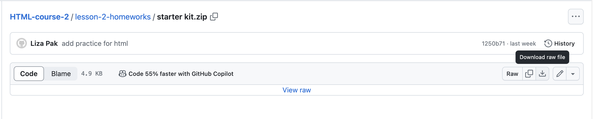

# Lesson 2. Semantic HTML

**[Presentation](presentations/presentation-2.pdf)** 
**[Manual](manuals/manual-2.pdf)** 

**[Video record](https://drive.google.com/file/d/1LFTQpNfXoO1y0rZUdSaZknG6Ak9EGKBn/view?usp=drive_link)** 
**[Practice](practice/practice-2.pdf)**  

**[Example project markup Pharmify](https://github.com/broacademy/pharmify)** 

[Criteria for HTML Course Quality](criteria.md) 

# Homework

1. [FreeCodeCamp HTML Course](https://www.freecodecamp.org/learn/2022/responsive-web-design/learn-html-by-building-a-cat-photo-app/step-1)   
   or   
   [Scaler HTML Course](https://www.scaler.com/topics/html/). Complete Modules 1-5.

2. Emmet Practice 
   - Use the [Emmet](https://emmet.io/) to improve your efficiency in writing HTML and CSS code.  
   - [Free course on Emmet.](https://www.udemy.com/course/emmet-start-coding-html-and-css-fast-and-easy/) Getting started, Emmet & HTML.

3. Detailed Tutorial on Creating and Marking Up a Web Page. You can skip it, if you have experience with markup basic. 
   - [MaxDesign Tutorial](https://russmaxdesign.github.io/maxdesign-slides/01-html/106-creating-document.html#/)
   - This tutorial provides step-by-step instructions on marking up a webpage. You can choose any text to place on your site, such as your hobby—nuclear reactors of submarines, extinct animals, or Winx fairies. You can work in a code editor or CodePen. The goal is to consolidate all the steps for marking up a document and create a simple markup.

4. Assignment for choosing semantic tags:  

   It is necessary to mark up an HTML document with a recipe. Creating an external resemblance is not required; the main thing is to select elements for markup as semantically as possible.

   1. Download archive with [starter kit](lesson-2-homeworks/starter-kit.zip) for projects.  
      
   2. Download materials for this task:  
      [Text for the site](lesson-2-homeworks/macarons/text.txt) 
      [Images for the site](lesson-2-homeworks/macarons/img)   
   3. Add images to your project folder.  
   4. Add text to your index.html.  
   5. Choose semantic tags by example:  
      [Example result](lesson-2-homeworks/macarons/example.pdf)  
   6. Collect the markup files in an archive and attach them in the comments to your task in Jira.

5. Make semantic markup for the all blocks of the [template](https://www.figma.com/design/jqIedRSOsKC20T9QeDDNdL/BinaBox-UI-KIT?m=auto&t=gBzlUoU5MRyDe3QY-6) with exclusions.

   1. Download archive with [starter kit](lesson-2-homeworks/starter-kit.zip) for projects.
   2. Create files for markup:  
      - Home page - index.html  
      - Catalog page - catalog.html  
      - Item page - catalog-item.html  
   3. Choose semantic tags, exclude blocks with forms:  
      - Home page (exclude the subscribtion block in the page footer)  
      - Catalog page (exclude the filter block on the left)  
      
      Consider the semantic meaning of the tags and their purpose.   
      All elements should be assigned classes. [Common class names cheat sheet](lesson-2-homeworks/class-names.md).  
   4. Before submitting for review, [validate](https://validator.nu/#textarea) the markup.
   5. Check [headings tree](https://yoksel.github.io/html-tree/)
   6. Collect the markup files in an archive and attach it in the comments to your task in Jira.

   The markup should be done using Emmet.  

## Additional homework 

1. Additional exercises by the same author from task 3:  
   - [Basic HTML](https://github.com/russmaxdesign/maxdesign-slides/blob/master/01-html/lesson01.pdf)
   - [Content Markup](https://github.com/russmaxdesign/maxdesign-slides/blob/master/01-html/lesson02.pdf)
   - [Scripts and Styles](https://github.com/russmaxdesign/maxdesign-slides/blob/master/01-html/lesson03.pdf)
   - [Tables](https://github.com/russmaxdesign/maxdesign-slides/blob/master/01-html/lesson04.pdf)
   - [Valid Markup](https://github.com/russmaxdesign/maxdesign-slides/blob/master/01-html/lesson06.pdf)

2. If the main homework is done and you want more practice, you can do other pages of your homework [template](https://www.figma.com/design/jqIedRSOsKC20T9QeDDNdL/BinaBox-UI-KIT?m=auto&t=gBzlUoU5MRyDe3QY-6):
   - blog page
   - blog article 
   - about us 
   - FAQ

In the next lessons, you can continue working on these layouts and start styling, but this is not mandatory.

# Additional materials eng 

https://help.figma.com/hc/en-us/articles/15297425105303-Explore-design-files 

🟢 **[Official HTML specification](https://www.w3.org/html/)**: This resource is a complete and authoritative source of information about the HTML standard, proposed by W3C. It contains all the necessary details about tags, attributes, and the structure of HTML documents, providing a fundamental foundation for developers striving to follow the latest web standards. It is critically important for a deep understanding of the basics of web development and ensuring compatibility with various browsers and devices. It might be challenging to read now, so it's worth returning to the specification with experience.

🟢 **[Stack Overflow: Best Technical Q&A Community](http://stackoverflow.com/)**: If you are learning HTML, you will find many discussions and answers to your questions on Stack Overflow. This community is the perfect place for knowledge exchange and problem-solving related to web development. Regardless of your level of knowledge, here you will find support and resources for learning and improving your HTML skills.

🔵 **[Introduction to HTML for Beginners](https://webdesign.tutsplus.com/introduction-to-html--CRS-200157c)**: This article offers an accessible and understandable explanation of the basics of HTML, perfect for those just starting their web development journey. With a focus on the practical aspects of creating web pages, it will be an excellent start for beginners.

🔵 **[Start with the basics: Learn HTML basics](https://webdesign.tutsplus.com/start-here-learn-html-basics--CRS-200500c)**: This resource is a practical guide for beginners wanting to master HTML. It leads the reader through the basic concepts and structures of HTML, providing a solid foundation for further learning and development in web development.

🔵 **[Create your first HTML document in just 60 seconds](https://webdesign.tutsplus.com/your-first-html-document-in-60-seconds--cms-25232t)**: This article demonstrates how quickly and easily you can start working with HTML by creating your first document. It is perfect for those looking for a quick start in learning web development.

🔵 **[HTML Is Used to Create...](https://www.scaler.com/topics/html-is-used-to-create/)**: This article is a thorough overview of how HTML is used to create web pages and web applications. It explains the various elements and structures that can be created using HTML, emphasizing its importance and versatility in web development. The article is ideal for those wanting to understand how HTML is used to create the internet we know.

🔵 **[Advantages of HTML](https://www.scaler.com/topics/advantages-of-html/)**: An exploration of the advantages of using HTML in web development. This article discusses why HTML remains a fundamental tool for creating web pages, despite the emergence of many new technologies. It covers aspects such as ease of use, accessibility, and scalability.

🔵 **[Features of HTML](https://www.scaler.com/topics/features-of-html/)**: This article is a deep dive into the key features of HTML and its role in creating modern web pages and applications. It examines the various elements available in HTML and how they can be used to enhance the user experience and functionality of a website.

🔵 **[What is HTML: General Uses and Defining Features](https://www.codecademy.com/resources/blog/what-is-html/)**: Codecademy offers an accessible introduction to HTML, explaining its general uses and key characteristics. The article is suitable for beginners who want to get a clear understanding of what HTML is and why it is so important in web development.

🔵 **[Introduction to HTML](https://www.scaler.com/topics/html/introduction-to-html/)**: This article provides a thorough introduction to HTML, covering its history, basics, and how it is used to create the structure of web pages. It is perfect for those starting their journey in web development and wanting to solidify their knowledge of the basics.

🔵 **[Structure of an HTML Document](https://www.scaler.com/topics/structure-of-html-document/)**: The article explains in detail how an HTML document is structured, including the order and relationship of various elements. This is essential reading for those who want to understand how to create effectively structured and semantically correct web pages.

🔵 **[Write HTML the HTML Way, Not the XHTML Way](https://css-tricks.com/write-html-the-html-way-not-the-xhtml-way/)**: This article from CSS-Tricks emphasizes the importance of writing HTML according to modern standards, moving away from XHTML practices. It provides valuable tips and best practices for developers aiming to write clean and compatible code.

🔵 **[Difference Between HTML and HTML5](https://www.scaler.com/topics/difference-between-html-and-html5/)**: This article explores the key differences between HTML and HTML5, discussing the innovations and improvements introduced in the latest version of the standard. It is intended for developers who want to update their knowledge and take advantage of the new features of HTML5.

🔵 **[Understanding the `<!DOCTYPE>` Declaration](https://www.scaler.com/topics/html/doctype-html/)**: The article explains the significance and role of the `<!DOCTYPE>` declaration in HTML documents. It reveals how to use this declaration correctly to define the version of HTML and ensure proper page rendering in browsers.

🔵 **[Additional HTML Elements](https://web.dev/articles/additional-html-elements?hl=en)**: This resource offers an overview of less-known but useful HTML elements that can be used to enhance the structure and semantics of web pages. It is intended for developers seeking to expand their knowledge and toolkit beyond the most commonly used tags.

## History

🔵 **[How HTML5 Came to Be](http://diveintohtml5.info/past.html)**: This article vividly tells the story of HTML's development up to version HTML5, highlighting significant moments and turning points in the history of web standards. It sheds light on the evolution and key changes that have made HTML5 one of the most powerful tools in the modern web developer's arsenal, explaining why these changes are so important to the industry as a whole.

🔵 **[A Brief History of HTML5](https://webdesign.tutsplus.com/a-brief-history-of-html5--net-23064a)**: This article provides a brief description of HTML5's history, highlighting its development and transformation into the leading tool for creating modern web applications and sites. The author shares important moments that every developer should know, showing how HTML5 has influenced the standards and practices of web development.

🔵 **[HTML Full Form](https://www.scaler.com/topics/html-full-form/)**: This article explains the full form of the HTML acronym and tells about its history. It provides interesting facts about the origin of HTML and its development over time, emphasizing the importance of HTML as the foundation of web technologies.

🔵 **[What is HTML5](https://webdesign.tutsplus.com/what-is-html5--cms-25803t)**: This article examines in detail what HTML5 is, its innovations and improvements over previous versions. The author explains how these changes improve web development and provide new opportunities for creating more dynamic and interactive web pages.

🔵 **[HTML vs. HTML5: Learn the Difference Between Them](https://www.atatus.com/blog/html-vs-html5-learn-the-difference-between-them/)**: This article compares HTML and HTML5, highlighting the key differences and innovations in the latest version of the standard. Readers are provided with information on how these changes affect the development process and offer new opportunities for web developers.

🔵 **[Difference Between HTML and DHTML](https://www.scaler.com/topics/difference-between-html-and-dhtml/)**: The article explains the difference between HTML and DHTML, highlighting their features and applications. The author shares important notes on how dynamic HTML changes the interaction with web pages and what advantages this brings to developers and users.

🔵 **[Difference Between HTML and XHTML](https://www.scaler.com/topics/difference-between-html-and-xhtml/)**: This article tells about the differences between HTML and XHTML, as well as how these differences affect web development. Readers will learn about the advantages and disadvantages of each format and how to choose the most suitable one for their projects.

🔵 **[Difference Between HTML and XML](https://www.scaler.com/topics/difference-between-html-and-xml/)**: This article compares HTML and XML, two important languages used in web development. It explains how each is used for different purposes and how their features determine their application in creating websites and web applications.

🔵 **[Justice For HTML/CSS: How These Languages Built The 2000s Internet & Launched Countless Tech Careers](https://www.codecademy.com/resources/blog/are-html-css-real-programming-languages/)**: This article from Codecademy defends HTML and CSS, arguing that they are real programming languages. It examines their contribution to creating the internet of the 2000s and how these languages helped launch countless tech careers.

## References

🔵 **[HTML Tutorial](https://devdojo.com/guide/html)**: This tutorial is designed for those who want to master HTML and become a real "ninja" in this field. From scratch to advanced level, the course materials teach how to create structured and quality web pages. Perfect for beginners and those who want to deepen their knowledge of HTML.

🔵 **[Official HTML Specification](https://html.spec.whatwg.org/multipage/)**: This document is the most complete and authoritative source of information about HTML. It contains everything you need to know about the markup language, its elements, and attributes. While the material may seem complex for beginners due to the abundance of technical terms, over time, it becomes an invaluable resource for a deep understanding of all aspects of HTML.

🔵 **[HTML Tags List](https://www.scaler.com/topics/html/html-tags-list/)**: The article presents a list of basic HTML tags and their use. This is a great starting resource for beginners who want to quickly familiarize themselves with the most commonly used tags and start practicing their application in their projects.

🔵 **[Elements and Structure Cheatsheets](https://www.codecademy.com/learn/learn-html-web-dev-path/modules/learn-html-elements/cheatsheet)**: Codecademy offers cheatsheets on HTML elements and structure that can serve as a quick reference when creating web pages. These cheatsheets are perfect for beginner developers wanting to solidify their knowledge of basic HTML elements and their usage.

## Syntax

🟢 **[The Difference Between HTML Elements and Tags](https://www.scaler.com/topics/difference-between-html-elements-and-tags/)**: This article provides a clear explanation of the differences between elements and tags in HTML, breaking down the basic concepts and examples. Understanding these differences is critically important for anyone studying web development and striving to write clean and efficient code.

🟢 **[Self-Closing Tags in HTML](https://www.scaler.com/topics/self-closing-tags-in-html/)**: Learn how and when to use self-closing tags in HTML. This article describes which HTML elements do not require a closing tag and how to properly apply them for elements without content, which is an important part of writing efficient code.

🔵 **[HTML Tags Are Enclosed In...](https://www.scaler.com/topics/html-tags-are-enclosed-in/)**: This article explains which symbols are used to enclose HTML tags, exploring the basics of HTML syntax. Understanding this concept helps beginners in web development quickly adapt to writing HTML code.

🟢 **[Is HTML Case-Sensitive?](https://www.scaler.com/topics/html-is-case-sensitive-language/)**: The article addresses the issue of case sensitivity in HTML, providing a clear explanation of how HTML interprets the case of characters in tags and attributes. This knowledge is necessary for understanding how different browsers process HTML code.

🟢 **[Comments in HTML](https://www.scaler.com/topics/comments-in-html/)**: This material explains how to add comments in HTML to document and organize code. Comments play a key role in development, allowing developers to leave notes and explanations without affecting the functionality of the code.

### Videos

🔵 **[Learn HTML with Codecademy](https://www.codecademy.com/resources/videos/html-and-css/learn-html-with-codecademy)**: Codecademy offers a learning video on HTML, which is part of their HTML and CSS course. The video tutorial is perfect for beginners looking to quickly and effectively master the basics of creating web pages. The series of lessons allows you to learn the structure of HTML, elements, attributes, and basic web design concepts, making the learning process interactive and understandable.

## Markup Rules

🟢 **[HTML Skeleton](https://www.joshwcomeau.com/snippets/html/html-skeleton/)**: Josh Comeau offers a basic HTML skeleton, which serves as a great starting template for any web project. The article demonstrates the basic structure of an HTML document, including the `<!DOCTYPE>`, `<html>`, `<head>`, and `<body>` tags, providing a solid foundation for further page development.

🔵 **[Common SEO Markup Mistakes](https://www.semrush.com/blog/biggest-seo-mistakes/#under-optimizing-meta-tags)**: SEMrush discusses common web development mistakes that can negatively impact SEO. Special attention is given to under-optimized meta tags, which are a critical aspect of improving web page visibility in search engines. Important recommendations can help avoid common SEO pitfalls.

🟢 **[15 Beginner Only HTML and CSS Mistakes](https://devdojo.com/rahulism/15-beginner-only-html-and-css-mistakes)**: Rahulism on DevDojo shares a list of 15 typical mistakes often made by beginners when working with HTML and CSS. This resource can help beginners overcome initial difficulties and improve the quality of their code.

🟢  **[Examples of Various HTML Codes with Comments](https://css-tricks.com/snippets/html/)**: CSS-Tricks offers a collection of HTML snippets with comments that can serve as useful guides and sources of inspiration for developers. In addition to HTML, the site also features articles on a variety of topics related to web development.

🔵 **[Table Indicating Element Types](http://russmaxdesign.github.io/html-css-tests/sample-full-element-list/index.htm)**: This resource provides a table classifying HTML5 elements by types and categories. The table can help developers better understand element membership and correctly use them when creating web pages.

🟢 **[The Correct Sequence of HTML Tags for Starting a Web Page Is...](https://www.scaler.com/topics/the-correct-sequence-of-html-tags-for-starting-a-web-page-is/)**: Learn about the correct sequence of HTML tags necessary for starting a web page. This article is an excellent resource for beginner developers wanting to learn about the structure of HTML documents and best practices for creating them.

## Semantics

🔵 **[What is Semantic HTML & Why Is It Important for Accessibility?](https://www.codecademy.com/resources/blog/semantic-html/)**: Codecademy provides a detailed overview of semantic HTML, explaining why it is critically important for accessibility. The article emphasizes how semantic markup helps create more accessible web pages, improving interaction with various screen reading devices and search engines, which in turn contributes to broader content accessibility on the internet.

🔵 **[Importance of Tags from an SEO Perspective](https://www.semrush.com/blog/best-practices-in-semantic-html5-for-content-writers/)**: SEMrush shares best practices for using semantic HTML5 from an SEO perspective for content marketers. The article explains how the correct application of semantic tags can significantly improve a website's positioning in search engines, making content more understandable and relevant to search queries.

🟢 **[Semantic Tags in HTML](https://www.scaler.com/topics/html/semantic-tags-in-html/)**: Scaler explains the importance of semantic tags in HTML, emphasizing their role in improving accessibility and SEO. The article provides an overview of the main semantic elements and their application for creating structured and logically organized web pages.

🔵 **[Semantic HTML Cheatsheets](https://www.codecademy.com/learn/learn-html-semantic-html/modules/html-semantic-html/cheatsheet)**: Codecademy offers cheatsheets on semantic HTML, serving as a quick reference for developers wanting to use semantic elements in their projects. These cheatsheets make it easier to choose the correct tags for content markup, contributing to the creation of more accessible and SEO-optimized web pages.

## Tags

🔵 **[10 Rare HTML Tags You Really Should Know](https://webdesign.tutsplus.com/10-rare-html-tags-you-really-should-know--net-3908a)**: This article on Tuts+ discusses 10 rarely used HTML tags that can be very useful in certain web development situations. The author offers an interesting overview of elements such as `<kbd>`, `<samp>`, and `<code>`, explaining their purpose and examples of use. This article will help developers expand their toolkit for more efficient and thoughtful web content creation.

### Head

🟢 **[The `<head>` Tag in HTML](https://www.scaler.com/topics/html/head-tag-in-html/)**: This article provides a comprehensive overview of the `<head>` tag in HTML, which is an important element of every web page, containing metadata, links to styles, scripts, and other information necessary for the correct display and functioning of the page.

🔵 **[How to Properly Fill the Head Tag](https://htmlhead.dev/?ref=tiny-helpers)**: This resource offers a detailed guide on optimally filling the `<head>` tag, including modern practices and examples of using various meta tags, links, and other elements that should be included to improve SEO, compatibility, and user experience.

🔵 **[The `<meta>` Tag in HTML](https://www.scaler.com/topics/meta-tag-in-html/)**: The article explains the use of the `<meta>` tag to define meta-information in HTML. It explains how to properly use meta tags to specify page descriptions, keywords, authorship, and other important data that help search engines and other services better understand and index content.

🔵 **[Meta Tags and Other Useful HTML Tags](https://sharkcoder.com/html/meta)**: This resource teaches the use of the most useful and relevant meta tags, providing search engines with information about your web page. In addition to meta tags, the article also covers other important HTML tags that can improve SEO and user experience.

🔵 **[Meta Tags and SEO](https://webdesign.tutsplus.com/meta-tags-and-seo--webdesign-9683a)**: The article explains the role of meta tags in SEO, emphasizing their importance for optimizing web pages. It provides specific examples and best practices for using meta tags to improve visibility in search engines.

🔵 **[The `<link>` Tag in HTML](https://www.scaler.com/topics/link-tag-in-html/)**: This article explains the use of the `<link>` tag to link external styles and other resources to the web page. It demonstrates how to properly use this tag to connect style sheets, favicon icons, and other elements.

🔵 **[Why the Title Tag Is Important](https://www.semrush.com/blog/title-tag/)**: SEMrush emphasizes the significance of the `<title>` tag for SEO and user perception. The article discusses best practices for crafting page titles that attract user attention and improve site positioning in search results.

🔵 **[What the Viewport Meta Tag Consists Of](http://russmaxdesign.github.io/html-css-tests/sample-meta/index.htm)**: This page provides a detailed explanation of the `<meta name="viewport">` tag, which is critically important for optimizing web pages for mobile devices. It explains how using this tag affects scaling and visual display of content on different devices.

### Structural Tags

🟢 **[The `<body>` Tag in HTML](https://www.scaler.com/topics/html/body-tag-in-html/)**: The role and attributes of the `<body>` element in HTML, which serves as a container for the main content of the web page, including text, images, links, and other web design elements.

🟢 **[The `<main>` Tag in HTML](https://www.scaler.com/topics/main-tag-in-html/)**: Using the `<main>` tag to define the main content of the web page, helping search engines and assistive technologies identify the central content of the page.

🟢 **[The `<nav>` Tag in HTML](https://www.scaler.com/topics/nav-tag-in-html/)**: Application of the `<nav>` tag for creating a navigation menu on the web page, improving user orientation on the site and its overall navigation structure.

🟢 **[The `<header>` Tag in HTML](https://www.scaler.com/topics/header-tag-in-html/)**: Using the `<header>` tag to define the top part of the web page, including headings, logos, and navigation elements that introduce the user to the site's content.

🟢 **[The `` Tag in HTML](https://www.scaler.com/topics/span-tag-in-html/)** and **[The `
` and `` Tags in HTML](https://www.scaler.com/topics/div-and-span-in-html/)**: An overview of the roles of the `
` and `` tags in grouping and styling elements in HTML, allowing developers to create visually appealing and structurally organized web pages.

🟢 **[The `<section>` Tag in HTML](https://www.scaler.com/topics/section-tag-in-html/)**, **[The `<article>` Tag in HTML](https://www.scaler.com/topics/article-tag-in-html/)**, and **[Difference Between `<aside>` and `<article>`](https://htmlacademy.ru/blog/css/aside-vs-article)**: Details on the semantic use of the `<section>`, `<article>`, and differences between `<aside>` and `<article>`, emphasizing their importance in structuring content and improving accessibility.

🔵 **[Using Article and Section Elements for Accessibility](https://www.smashingmagazine.com/2022/07/article-section-elements-accessibility/)**: Recommendations for using the `<article>` and `<section>` elements to improve content accessibility, ensuring better interaction with the website for all users.

🔵 **[Quick Tip: Consider Wrapping Your Code with a `<figure>` Element](https://webdesign.tutsplus.com/quick-tip-consider-wrapping-your-code-with-a-figure-element--cms-21646t)**: Tips on using the `<figure>` tag to wrap code on a web page, improving content structuring and visual presentation.

### Text

🟢 **[Basic Tags for Text Markup](https://www.semrush.com/blog/html-tags-list/)**: SEMrush presents an overview of basic tags for text markup in HTML, explaining their role and application for creating structured and semantically correct content.

🟢 **[Using the `
` Tag](https://www.scaler.com/topics/p-tag-in-html/)**: Explanation of using the `
` tag to create paragraphs, which is the foundation of text markup on web pages.

🟢 **[Using the ` ` Tag](https://www.scaler.com/topics/br-tag-in-html/)**: Explanation of applying the ` ` tag to insert line breaks when necessary for improving text readability.

🟢 **[Using the Horizontal Line (`
`)](https://www.scaler.com/topics/hr-tag-in-html/)**: Explanation of how the `
` tag is used to visually separate content on web pages.

🟢 **[HTML Quotations](https://www.scaler.com/topics/html/html-quotations/)**: An overview of various ways to insert quotations in HTML code and design approaches to their formatting.

🔵 **[Using the `` Tag](https://www.scaler.com/topics/sub-tag-in-html/)**: Learn how to apply the `` tag to display text in subscript, useful in scientific and mathematical documents.

🔵 **[Superscript in HTML](https://www.scaler.com/topics/superscipt-in-html/)**: Explanation of using superscript with the `` tag, often used in scientific works and footnotes.

🔵 **[Using the `<mark>` Tag](https://www.scaler.com/topics/mark-tag-in-html/)**: Explanation of applying the `<mark>` tag to highlight text, helping users quickly find important fragments of information.

🔵 **[Using the `<del>` Tag](https://www.scaler.com/topics/del-tag-in-html/)**: An overview of using the `<del>` tag to denote deleted text, useful for showing edits or changes in a document.

🔵 **[Using the `<kbd>` Tag](https://www.scaler.com/topics/kbd-tag-in-html/)**: Explanation of applying the `<kbd>` tag to display keys or key combinations, useful in guides and instructions.

🔵 **[The `<strike>` Tag and Its Use](https://www.scaler.com/topics/strike-tag-in-html/)**: Consideration of the `<strike>` tag for strikethrough text, although its use is considered outdated in favor of `<del>`.

🔵 **[Using the `<cite>` Tag](https://www.scaler.com/topics/cite-tag-in-html/)**: Explanation of applying the `<cite>` tag to denote titles of works such as books, movies, music compositions.

🔵 **[Using the `<abbr>` Tag](https://www.scaler.com/topics/abbr-tag-in-html/)** and **[Issues with Abbreviations](https://www.tempertemper.net/blog/abbreviations-can-be-problematic)**: A guide on using the `<abbr>` tag for abbreviations and acronyms and discussing potential accessibility issues related to their use.

🔵 **[Emphasis in Text with `<em>`](https://www.scaler.com/topics/em-tag-in-html/)**: Explanation of using the `<em>` tag to emphasize text, improving its perception by readers.

🔵 **[Displaying Code with `<code>`](https://www.scaler.com/topics/code-tag-in-html/)**: Explanation of using the `<code>` tag to insert code fragments into a document, making them easier to read and understand.

🔵 **[Using the `<ins>` Tag](https://www.scaler.com/topics/ins-tag-in-html/)**: An overview of using the `<ins>` tag to denote inserted text, useful for showing changes or updates in a document.

🔵 **[Italic with `<i>`](https://www.scaler.com/topics/i-tag-in-html/)**: Consideration of using the `<i>` tag to italicize text, although its semantic meaning has shifted towards presenting text different from the standard rather than simple italics.

🔵 **[Creating Scrolling Text with `<marquee>`](https://www.scaler.com/topics/html/marquee-tag-in-html/)**: Explanation of using the `<marquee>` tag to create scrolling text, which is outdated and not recommended for use in modern web standards.

🟢 **[Highlighting Important Text with `<strong>`](https://www.scaler.com/topics/strong-tag-in-html/)**: Explanation of using the `<strong>` tag to highlight important text, helping improve its perception and the semantic structure of the document.

🔵 **[Preformatted Text with `<pre>`](https://www.scaler.com/topics/pre-tag-in-html/)**: Using the `<pre>` tag to display preformatted text, preserving spaces and line breaks, which is especially useful for code or poetry.

### Headings

🟢 **[Headings and Paragraphs in HTML](https://www.scaler.com/topics/html/headings-and-paragraphs-in-html/)**: Scaler provides an overview of using headings and paragraphs in HTML, emphasizing their role in organizing content and improving readability of web pages.

🟢 **[The Truth About Multiple `<h1>` Tags in the HTML5 Era](https://webdesign.tutsplus.com/the-truth-about-multiple-h1-tags-in-the-html5-era--webdesign-16824a)**: This article on Tuts+ explains modern approaches to using multiple `<h1>` tags in the context of HTML5, dispelling old beliefs about limiting to one `<h1>` per page and explaining how this can contribute to a better semantic structure of the document.

### Lists

🟢 **[Nested List in HTML](https://www.scaler.com/topics/nested-list-in-html/)**: Explains how to create nested lists in HTML, allowing detailed organization of information and improved document navigation.

🟢 **[Creative List Styling](https://web.dev/articles/creative-list-styling)**: This article offers ideas and methods for creative list styling in HTML, using CSS to create visually appealing and functional designs.

🔵 **[The `<ol>` Tag in HTML](https://www.scaler.com/topics/ol-tag-in-html/)**: Explains the use of ordered lists (`<ol>`) in HTML, which are ideal for presenting sequential or hierarchical information.

🔵 **[The `<ul>` Tag in HTML](https://www.scaler.com/topics/ul-tag-in-html/)**: Explains the use of unordered lists (`<ul>`) for grouping related items where order does not matter.

🔵 **[The `<li>` Tag in HTML](https://www.scaler.com/topics/li-tag-in-html/)**: Explains how to create list items (`<li>`) within the context of `<ul>` and `<ol>`, which are the primary building blocks of lists in HTML.

🔵 **[The `<dt>` Tag in HTML](https://www.scaler.com/topics/dt-tag-in-html/)**: Introduces the `<dt>` tag used to define a term in a definition list, making it an integral part of the `<dl>` structure.

🔵 **[The `<dd>` Tag in HTML](https://www.scaler.com/topics/dd-tag-in-html/)**: Explains the use of the `<dd>` tag for providing the definition or description of a term in a definition list.

🔵 **[The `<dl>` Tag in HTML](https://www.scaler.com/topics/dl-tag-in-html/)**: Explains the use of the `<dl>` tag for creating a definition list, including terms (`<dt>`) and their descriptions (`<dd>`), providing an effective way to structure paired information.

### Tables

🔵 **[Tables Cheatsheets](https://www.codecademy.com/learn/learn-html-tables/modules/html-tables/cheatsheet)**: Codecademy provides cheatsheets on tables in HTML, including the basic elements and attributes needed to create organized and visually appealing tables.

🟢 **[A Complete Guide to the `<table>` Element](https://css-tricks.com/complete-guide-table-element/)**: CSS-Tricks offers a detailed guide on using the `<table>` element in HTML and its attributes, covering everything from basic structure to complex formatting examples.

🔵 **[How to Build a Stylish Responsive HTML Table](https://webdesign.tutsplus.com/how-to-build-a-stylish-responsive-html-table--cms-93253t)**: This guide on creating stylish and responsive tables in HTML offers modern styling methods that adapt tables to various devices and screen sizes.

🟢 **[Nested Table in HTML](https://www.scaler.com/topics/nested-table-in-html/)**: The article explains how to create nested tables in HTML, allowing detailed organization of complex data sets within the main table.

🔵 **[The `<table>` Tag in HTML](https://www.scaler.com/topics/table-tag-in-html/)**: An overview of the `<table>` tag and its role in creating tables in HTML, including basic information on structure and use.

🔵 **[The `<thead>` Tag in HTML](https://www.scaler.com/topics/thead/)**: The article explains the use of the `<thead>` tag to define the top part of a table, improving semantic structure and making data perception easier.

🔵 **[The `<th>` Tag in HTML](https://www.scaler.com/topics/th-tag-in-html/)**: Clarifies the role of the `<th>` tag in defining headers in HTML tables, helping improve accessibility and structuring of information.

🔵 **[The `<td>` Tag in HTML](https://www.scaler.com/topics/td-tag-in-html/)**: Explains how to use the `<td>` tag to create cells in HTML tables, representing the main content of the table.

🔵 **[The `<tr>` Tag in HTML](https://www.scaler.com/topics/tr-tag-in-html/)**: The article explains the use of the `<tr>` tag to create rows in HTML tables, which are the foundation for grouping cells.

### Interactive

🔵 **[Creating Custom Dialog Components in HTML](https://css-tricks.com/dialog-components-roll-your-own/)**: This article on CSS-Tricks explains how to create custom dialog components in HTML to improve your website's interactivity. It offers detailed instructions and code examples to help developers implement custom dialog windows that enhance user experience.

🟢 **[Explaining the `
` and `
` Elements](https://webdesign.tutsplus.com/explaining-the-details-and-summary-elements--cms-21999t)** and **[The `
` Tag in HTML](https://www.scaler.com/topics/details-tag-in-html/)**: These articles explain how to use the `
` and `
` elements to create expandable sections on web pages. They provide valuable tips for using these tags to organize content and create interactive accordions, making information more accessible and convenient for users.

### Links / Buttons

🟢 **[The `<a>` Tag in HTML](https://www.scaler.com/topics/anchor-tag-in-html/)**: This article provides an overview of using the `<a>` tag to create hyperlinks, enabling navigation to other web pages, and explains various attributes for customizing link behavior.

🟢 **[Quick Tip: Make Telephone Numbers Do Something](https://webdesign.tutsplus.com/quick-tip-make-telephone-numbers-do-something--webdesign-9271a)**: Tips on turning telephone numbers into interactive elements on a web page, allowing users to make calls directly from the site.

🟢 **[Email Link in HTML](https://www.scaler.com/topics/email-link-in-html/)**: A guide to creating email links using HTML, utilizing the `<a>` tag to make it easy for users to send messages.

🟢 **[Nested Links Without Nesting Links](https://www.sarasoueidan.com/blog/nested-links/)**: An overview of techniques for creating nested links without actually nesting link elements, adhering to web development standards.

🔵 **[HTML Download Link](https://www.scaler.com/topics/html-download-link/)**: Instructions on creating links for downloading files, allowing users to download content directly from your site.

🟢 **[How to Link to a Specific Part of a Page in HTML](https://www.scaler.com/topics/how-to-link-to-a-specific-part-of-a-page-html/)**: A guide to creating links that redirect users to a specific part of the page, improving navigation and user experience.

🟢 **[The `<button>`Tag in HTML](https://www.scaler.com/topics/button-tag-in-html/)**: An overview of using the `<button>` tag to create buttons that handle user actions on the web page.

🟢 **[A Complete Guide to Links and Buttons](https://css-tricks.com/a-complete-guide-to-links-and-buttons/)**: A complete guide to creating links and buttons, including semantics, accessibility, and best practices for optimizing user interaction on your site.

## Attributes

🔵 **[List of Attributes and Tags They Can Apply To](https://html.spec.whatwg.org/multipage/indices.html#attributes-3)**: The official HTML specification offers a comprehensive list of attributes and indicates the tags to which they can be applied. This resource may seem complex at first glance but will become invaluable as you develop as a developer.

🟢 **[About Attributes](https://web.dev/learn/html/attributes/)**: Web developers are offered a deep dive into the world of HTML attributes, discussing their importance and application for controlling the behavior and appearance of web page elements.

🔵 **[HTML Attributes You Rarely Use](https://www.smashingmagazine.com/2022/03/html-attributes-you-never-use/)**: The article examines rarely used attributes in HTML, offering ideas for their creative application in projects.

🔵 **[A Complete Guide to Data Attributes in HTML](https://css-tricks.com/a-complete-guide-to-data-attributes/)**: Learn how to use data attributes to store additional data directly on page elements, extending functionality without external JavaScript intervention.

🟢 **[Use the `lang` Attribute for Better Accessibility](https://webdesign.tutsplus.com/use-the-lang-attribute-for-better-accessibility--cms-31961t)**: Explanation of the importance of the `lang` attribute for improving web page accessibility, helping screen readers interpret the content's language correctly.

🔵 **[HTML Hidden Attribute](https://www.scaler.com/topics/html-hidden/)**: Explanation of the `hidden` attribute in HTML and its use for hiding elements on the page.

🔵 **[Quick Tip: Using the HTML5 `download` Attribute](https://webdesign.tutsplus.com/quick-tip-using-the-html5-download-attribute--cms-23880t)**: Learn how to use the `download` attribute to tell the browser to download the specified resource instead of navigating to it.

### Class

🟢 **[What Makes for a Semantic Class Name?](https://css-tricks.com/semantic-class-names/)**: CSS-Tricks discusses what makes a class name semantically meaningful, explaining the importance of choosing names that accurately describe the element's purpose rather than its appearance or position on the page. This contributes to more intuitive understanding and easier future project development.

### Tools

🔵 **[HTML Arrows](https://www.toptal.com/designers/htmlarrows/?ref=tiny-helpers)**: A collection of the most popular special characters, including arrows, mathematical symbols, and others that can be easily copied and pasted into HTML code. The tool is useful for designers and developers looking to enhance the visual aspect of their projects.

## Figma

🟢 **[Everything Developers Must Know About Figma](https://www.smashingmagazine.com/2022/08/everything-developers-must-know-about-figma)** - The article covers all aspects of Figma that developers need to know for effective work. Includes best practices for using, tips for optimizing workflows, and integrating design with code.

## Emmet

It is very useful to learn and know, with practice all the abbreviations are memorized and in general, they are organically understandable and save coding time many times over.

🔵 **[Emmet.io](http://emmet.io)**: The official website of Emmet, a powerful tool for web developers that significantly speeds up the process of writing HTML and CSS code through the use of abbreviations and automation. An indispensable resource for improving the efficiency of your work.

🟢 **[Emmet Cheat Sheet](http://docs.emmet.io/cheat-sheet/)**: A cheat sheet for Emmet, containing a list of the most useful abbreviations and commands. This resource will be your reliable assistant in mastering Emmet and will significantly speed up the layout process.

🔵 **[Free Emmet Course on Udemy](https://www.udemy.com/course/emmet-start-coding-html-and-css-fast-and-easy/)**: A training course that offers a quick start in using Emmet for effective website development. The course is suitable for both beginners and experienced developers wanting to improve their skills.

🟢 **[Emmet in CodePen](https://codepen.io/russweakley/details/RwjByzW)**: An example of using Emmet directly in CodePen, demonstrating the possibilities and advantages of this tool in real development. A great way to see how Emmet can simplify and speed up coding.

🟢 **[Emmet Cheat Sheet on Scaler](https://www.scaler.com/topics/html/emmet-cheat-sheet/)**: Another Emmet cheat sheet that provides an overview of basic abbreviations and commands. Use it to increase productivity when working with HTML and CSS.

## Courses

**[Learn HTML on Web.dev](https://web.dev/learn/html)**: This course for web developers provides a solid understanding of HTML at all levels, from beginner to expert. A great start to mastering the basics of web development.

**[Learn HTML: Semantic HTML on Codecademy](https://www.codecademy.com/learn/learn-html-semantic-html)**: The course is dedicated to semantic HTML, which will help improve the structure of your web pages and make them more accessible.

**[Learn HTML: Fundamentals on Codecademy](https://www.codecademy.com/learn/learn-html-fundamentals)**: HTML basics for those starting their journey in web development. The course teaches basic tags and layout practices.

**[Learn HTML on Codecademy](https://www.codecademy.com/learn/learn-html)**: A general course on HTML on Codecademy, covering everything from basic to more advanced aspects of the markup language.

**[Learn HTML & CSS: How To Start Your Web Development Career on Udemy](https://www.udemy.com/course/how-i-landed-a-web-development-job-earned-5k-freelancing/)**: A free course that will tell you how to start a web developer career, focusing on HTML and CSS.

**[Semantic HTML: How to Structure Web Pages on Tuts+](https://webdesign.tutsplus.com/semantic-html-how-to-structure-web-pages--CRS-200231c)**: The course teaches the use of semantic tags in HTML to create well-structured web pages.

**[Figma to HTML: Code Up a Single Page Design on Tuts+](https://webdesign.tutsplus.com/figma-to-html-code-up-a-single-page-design--CRS-200953c)**: Learn how to turn a design from Figma into a working web page using HTML. The course is suitable for designers and developers wanting to improve their skills in implementing designs.

## Demos

This section contains examples of different components in code. You can take code from here for layout.

**[Examples of What All HTML Tags Look Like on a Page Without Styles](http://russmaxdesign.github.io/html-css-tests/sample-format/index.htm)**: This resource demonstrates the appearance of all HTML tags in their "raw" form without applying styles. A great way to see the basic structure and behavior of elements.

**[An Example of Headers Having Different Styles Depending on the Level](https://codepen.io/russweakley/pen/bGmQbvB)**: A demonstration of how headers of various levels (`<h1>`-`<h6>`) can be styled differently to achieve visual hierarchical distinction.

**[Bad/Good Classes for Headers](https://codepen.io/russweakley/pen/YzamMZg)**: Examples of naming classes for headers, showing the difference between good and bad naming practices to improve code readability and maintainability.

**[Navigation Markup Example](https://russmaxdesign.github.io/navbar/#)**: Various examples of markup for navigation panels, demonstrating best practices for laying out menus.

**[The `<abbr>` Tag](https://codepen.io/russweakley/pen/jOZdGrX)**: An example of using the `<abbr>` tag for abbreviations with tooltips to improve user understanding of abbreviations.

**[Clickable Card Markup](https://codepen.io/russweakley/pen/PoewojO)**: Demonstrations of two ways to create clickable cards, highlighting the advantages and disadvantages of each approach.

**[How the `
` Tag Works](https://codepen.io/russweakley/pen/vYrRERK)**: Examples of using the `
` tag to create collapsible sections, improving content structuring and interactivity.

**[What the `<mark>` Tag is For](https://codepen.io/russweakley/pen/BaVVRXV)**: An example of using the `<mark>` tag to highlight text, improving visual attention to important fragments.

**[Dropdown Menu Markup](https://codepen.io/russweakley/pen/YzOxRPb)**: Shows how to create dropdown menus using CSS for styling, including a hover activation variant.

**[Dropdown Menu Demo](http://codepen.io/lizzzzzy/pen/OReqow)**: Another example of markup and styling for a dropdown menu, demonstrating the smooth appearance and disappearance of menu items.

**[An Example of a Link with Button Styles](https://codepen.io/russweakley/pen/QWZzeWx)**: A demonstration of how to style links (`<a>`) to look like buttons while retaining their primary purpose.

**[Table Markup Example](https://codepen.io/russweakley/pen/ExEzKKP)**: Shows how to create a structured table using `<table>`, `<th>`, `<tr>`, `<td>`, demonstrating the basic table markup.

**[What a Table Consists of](https://codepen.io/russweakley/details/xxPeJpj)**: Explanation of the table structure, including header, body, and footer elements for organizing data.

**[Table Markup Example with 4 Columns](https://codepen.io/russweakley/pen/vYQENYY)** and **[Table with 5 Columns](https://codepen.io/russweakley/pen/poQvjwV)**: These examples demonstrate how to create tables with different numbers of columns, offering layouts for various types of data.

**[Examples of Using Table Properties](https://codepen.io/russweakley/pen/eYeoQQe)**: Shows various ways to style and format tables using CSS.

**[Boolean Attributes](https://codepen.io/russweakley/details/ZEajLjp)**: Explanation and demonstration of using boolean attributes in HTML, such as `disabled`, `checked`, `readonly`.

**[Void Elements](https://codepen.io/russweakley/pen/zYPLNaw)**: Examples of using self-closing tags, such as ``, ` `, `
`, demonstrating their features and purpose.

## Tools

**[HTML Tag Memory Game](https://tags.isthe.link/?setting=html5)**: A fun and useful game for those who want to test and improve their knowledge of HTML tags. A great way to train memory and learn new tags in a time-based challenge format.

**[Validator](https://validator.nu/#textarea)**: An online tool for checking HTML code for standard compliance. Helps identify and fix markup errors, which is important for ensuring cross-browser compatibility and content accessibility.

**[Can I Use](https://caniuse.com/)**: An indispensable resource for web developers, allowing you to check the support of various web technologies among browsers. Especially useful when implementing new features or striving to ensure maximum project compatibility.

**[Can I Include](https://caninclude.glitch.me/)**: A tool for checking if one HTML tag can be nested inside another. Great for learning proper layout practices and avoiding common mistakes.

**[HTML Tree](https://yoksel.github.io/html-tree/)**: A service for visualizing the structure of HTML markup, including the hierarchy of headings. Helps understand and optimize the page structure for better SEO and user experience (ru).

**[Dirty Markup](https://dirtymarkup.com/)**: A tool for cleaning and formatting "dirty" code. Supports HTML, CSS, and JavaScript, helping to tidy up code and improve readability.

**[Sonar](https://sonarwhal.com/)**: A linting tool for the web that analyzes web pages for performance, accessibility, security, and other important aspects.

**[Metatags.io](https://metatags.io/?ref=tiny-helpers)**: A tool for creating meta tags with the ability to preview how they will look in search engines and social networks. An excellent means for optimizing web pages for social media and SEO.

**[CSS Layout](https://phuoc.ng/collection/css-layout/?ref=tiny-helpers)**: A collection of ready-made CSS components that can be easily used in your projects. Includes a variety of layout templates, from simple elements to complex layouts.
